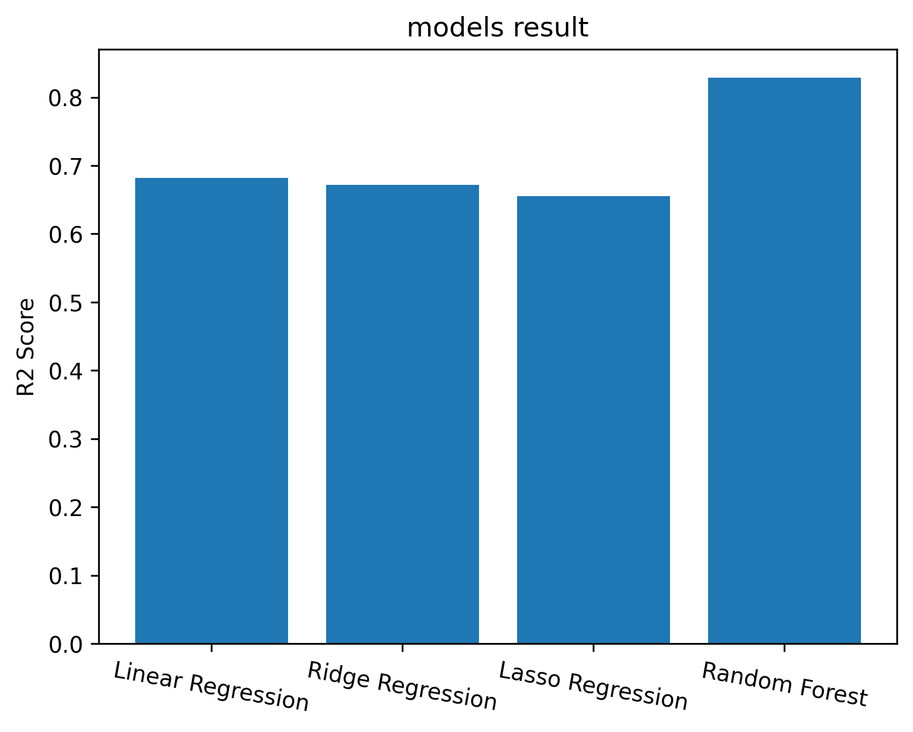

# 🏠 Boston House Price Prediction - Machine Learning Project
## Overview:
This project aims to predict house prices in Boston using various regression techniques. 
The dataset used is from the **Boston Housing Dataset**, containing features like number of rooms, location, and crime rate.
## 📊 The Dataset:
In this project we will use house a table dataset from *kaggle*, you can find out the details here : [The Dataset Link](https://www.kaggle.com/datasets/fedesoriano/the-boston-houseprice-data)
##### 🔹 Input features in order:
1) **`CRIM`**: per capita crime rate by town
2) **`ZN`**: proportion of residential land zoned for lots over 25,000 sq.ft.
3) **`INDUS`**: proportion of non-retail business acres per town
4) **`CHAS`**: Charles River dummy variable (1 if tract bounds river; 0 otherwise)
5) **`NOX`**: nitric oxides concentration (parts per 10 million) [parts/10M]
6) **`RM`**: average number of rooms per dwelling
7) **`AGE`**: proportion of owner-occupied units built prior to 1940
8) **`DIS`**: weighted distances to five Boston employment centres
9) **`RAD`**: index of accessibility to radial highways
10) **`TAX`**: full-value property-tax rate per $10,000 [$/10k]
11) **`PTRATIO`**: pupil-teacher ratio by town
12) **`B`**: The result of the equation B=1000(Bk - 0.63)^2 where Bk is the proportion of blacks by town
15) **`LSTAT`**: % lower status of the population
##### 🔹 Output variable:
1) **`MEDV`**: Median value of owner-occupied homes in $1000's [k$]
## ⚙️ How To Run:
### 1. Clone the repository:
```bash
git clone https://github.com/Saadlkh/BostonHouse-ML.git
```
### 2. install the required libraries:
If you clone the project, you find this file: (**requirements.txt**)
and you can install all the libraries you need like this:
```bash
pip install -r requirements.txt
```
But if you don't download the project, you can install the library like this:
```bash
pip install scikit-learn pandas matplotlib
```
(the pickle library is defaul install in python, if you want you can add it in the pip install list.)
[**Scikit-learn**](https://Scikit-learn.org/stable/)
[**Matplotlib**](https://matplotlib.org/stable/)
[**Pandas**](https://pandas.pydata.org/)
### 3. Run the Jupyter Notebook:
Go to the code editor and run the code,s ince we are using a notebook, it is better to open the code in an editor that supports this type of file, such as [**Jupyter**](https://jupyter.org/), which is specialized in this.
## 📈 Results & Performance:
To evaluate the model, we used R² Score as the primary metric. The model performed well in predicting house prices based on the given features.
-------------------


## 📜 License:
This project is open-source and licensed under the MIT License. Feel free to use and modify it!
